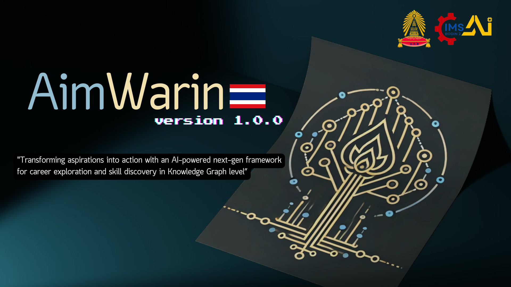
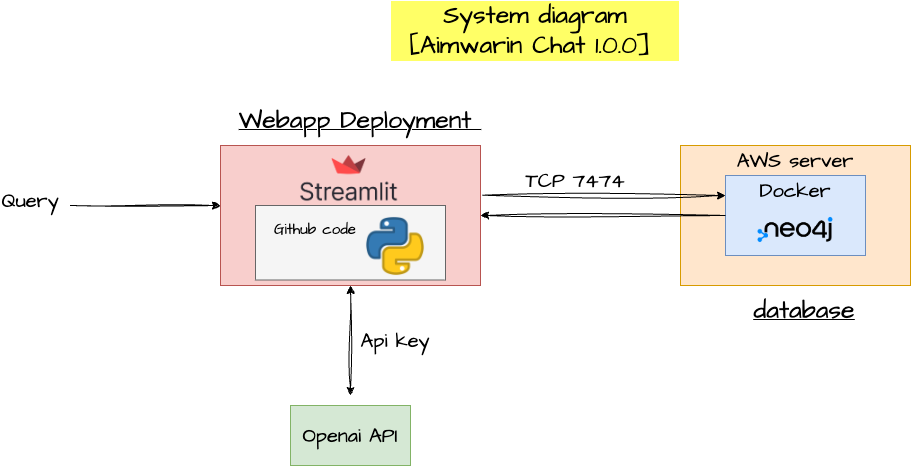

# Aimwarin-Chat 1.0.0  

### [Demo](https://aimwarin.streamlit.app/)  

Aimwarin-Chat 1.0.0 is an intelligent chatbot leveraging **Graph RAG (Graph Retrieval-Augmented Generation)** technology. By integrating advanced graph-based databases, the system organizes careers into categories and specific concepts. This unique approach allows the chatbot to:  
- Deliver precise answers to complex, multi-step queries.  
- Extract data from reliable, authoritative sources.  
- Provide personalized career recommendations.  

This cutting-edge solution is designed to tackle intricate questions with exceptional accuracy and depth, making it ideal for individuals seeking tailored career guidance or in-depth insights.

---

## Key Features  

- **Graph-Based Retrieval:** Efficiently organizes and retrieves information from graph-structured data, enhancing response accuracy.  
- **Personalized Recommendations:** Tailored career suggestions based on user inputs and preferences.  
- **Complex Query Handling:** Expertly answers multi-layered questions with precision, even when they span diverse topics.  
- **Reliable Data Sources:** Ensures answers are grounded in verified and trustworthy information.  

---

## Example in Action  

Below is a glimpse of Aimwarin-Chat in action:  

  

---

## System Architecture  

The system's robust architecture is designed for scalability and high performance.  

  

---

## Why Choose Aimwarin-Chat?  

1. **Accuracy and Depth:** Leverages the power of Graph RAG to ensure responses are comprehensive and precise.  
2. **Career-Oriented:** Specifically tailored to provide valuable insights and guidance on career-related queries.  
3. **Cutting-Edge Technology:** Incorporates state-of-the-art AI to handle complex queries effortlessly.  
4. **User-Centric Design:** Focused on delivering intuitive and meaningful interactions.  

---

**Experience the future of AI-powered career guidance with Aimwarin-Chat 1.0.0.** [Try the demo now!](https://aimwarin.streamlit.app/)
